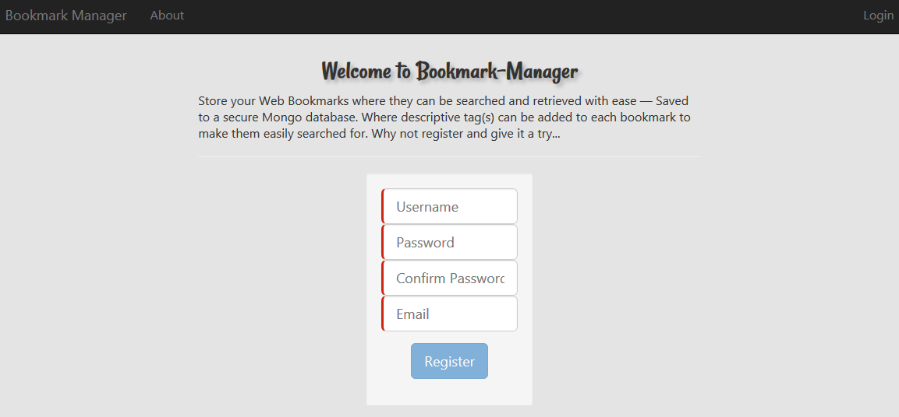
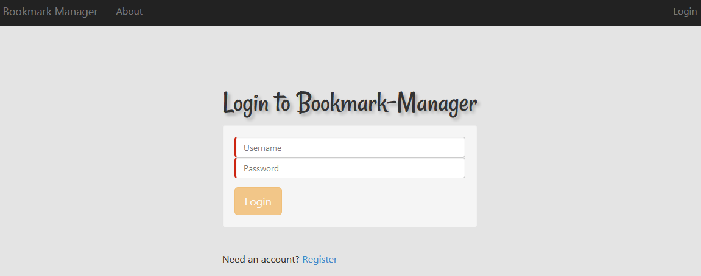
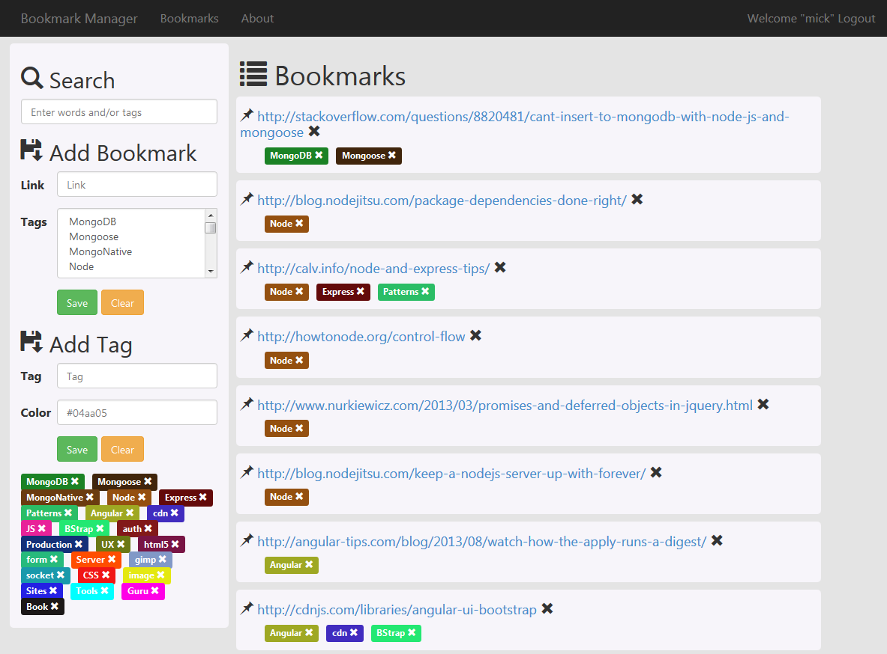

# Bookmark Manager

## Description

The client code has been taken from [Kevin Delemme](https://github.com/kdelemme/angularjs-bookmark-manager)

As Kevin puts it: "Bookmark Manager is a simple web application that allows you to save your bookmarks, associate tags to bookmarks and search for bookmarks."

I made the following changes:

* Added BOWER client package manager
* Arranged the client code to my liking 
* Added a HTML5 select element where multiple tag options may be added to a bookmark
* Added user authentication using JSON Web Tokens
* Added connection to MongoDB
* Added RESTful routes for client to interact with server via $http service (AJAX calls using JSON)

The program allows you to register and log on to the App using the username and password you selected.
The password is encrypted and stored will all the other data in a Mongo database.
You can create Tags and assign them to bookmarks you create under your account. 
No  other user has access to bookmarks/tags you create.

The JWT is sent with most server requests to the server, in some cases the JWT is sent to protect a secure route.
In other cases the JWT was sent because I extract the userId from the token payload for use by the server.
The JWT is set to expire after one hour (you can change this) - I have set no warning messages - 
requests to the server will just not work and you will need to log on again.

I removed the Mongoose SubDocuments I had created previously. 
The $pull command would not allow me to delete from the SubDoc arrays.

# Requirements

* MongoDB running
* Node
* bower client package manager

## Installation

* Clone the Repository
* npm install - install all the node packages listed in the package.json file 
* bower install - installs the front end packages listed in the bower.json file
* Turn on MongoDB
* Open ../server/config/database.js and enter Mongo database details
* node server.js - start up Node\Express server
* Browse to http://localhost:3080

## Technologies Used
 
Node, Express, Angular, Mongoose, MongoDB, Robomongo MongoDB client, REST API, Bower, Bcryptjs,
$http service to make AJAX requests over JSON in AngularJS.

## Screen Shots

		
		
		

		

Michael Cullen
2014
